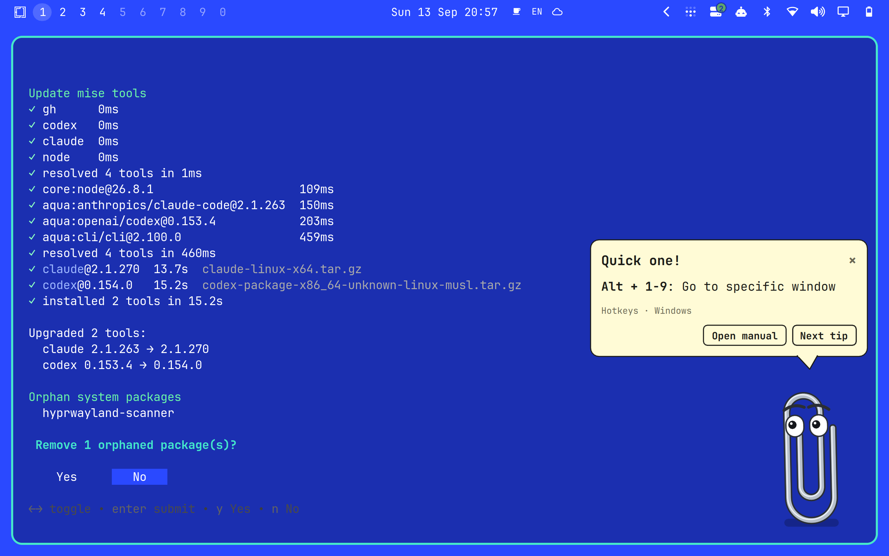

# Clippy for Omarchy



A paperclip in the bottom-right corner of your screen. His eyes follow your mouse, he bends his wire into the shapes the original Office Assistant knew, curls up when you walk away, and every now and then he taps the glass with a tip from the [Omarchy manual](https://omarchy.org/manual/).

## Install

```bash
omarchy plugin add https://github.com/jankeesvw/omarchy-clippy --enable
```

## Requirements

Omarchy 4 (Quattro) on Hyprland. Clippy uses only what Omarchy already ships: the system `python3` for the cursor helper and `omarchy-launch-webapp` to open the manual. No packages to install, no accounts, no API keys.

## Using him

| Do | He |
| --- | --- |
| Start the shell | rides in on a bicycle made of himself, his eyes as the wheels |
| Move the mouse | follows it with his eyes, even from the other side of the screen |
| Move the mouse near him | turns see-through and lets your clicks pass to whatever is behind him; rest the pointer on him for a moment and he is solid again |
| Drag him, or Super + drag | picks him up and puts him wherever you drop him; the spot is remembered |
| Left-click him | shows a tip from the manual, with a different reaction each time |
| Right-click him | curls up and asks whether you want him to go away |
| Open manual | turns into a check mark and opens the page on omarchy.org |
| Next tip | reacts (points, scratches his head, puts on his glasses, turns into an atom, ...) and shows another one; every tip comes once before any repeats |
| Ride off | folds into the bicycle and rides off the edge of the screen |
| Leave the mouse alone for two minutes | collapses into a pile of wire and snores until you move it |

The bubble closes by itself after 30 seconds unless the pointer is on it.

## His repertoire

The animations are modelled on the Office Assistant's own, but drawn from scratch: Clippy is one wire of 220 points, and every pose is that wire resampled, so he can bend from any shape into any other with a ripple on the way.

| Name | Original | What happens |
| --- | --- | --- |
| `attention` | GetAttention | huge eyes and two taps on the glass |
| `bang` | Wave | stretches up into an exclamation mark, eyes as the dot |
| `atom` | IdleAtom | unrolls into a ring, spins up into an atom with his eyes as electrons |
| `pile` | IdleRopePile | collapses into a coil and peeks around |
| `check` | Congratulate | a check mark |
| `point` | GestureUp | points up at the bubble |
| `scratch` | IdleHeadScratch | scratches his head |
| `tap` | IdleFingerTap | taps his foot, impatiently |
| `glasses` | CheckingSomething | reading glasses on |
| `music` | Hearing | headphones on, nodding along |
| `look` | IdleSideToSide | looks left and right |
| `brows` | IdleEyeBrowRaise | raises his eyebrows |
| `hop`, `wiggle`, `flip` | | the small stuff in between |

Like the Office Assistant, the big animations are reactions to what you do: every tip, button and click has its own. Left alone he idles in levels. For three minutes after you dealt with him he only blinks and follows the mouse; after that a small one (`look`, `brows`, `tap`, `glasses`) now and then; and once he has been ignored for ten minutes, occasionally a big one (`atom`, `pile`, `music`, `scratch`, `bang`, `flip`).

## Keyboard and IPC

Clippy takes the keyboard only when you click him, and shows an outline while he has it:

| Key | He |
| --- | --- |
| `W`, `Delete` or `Backspace` | rides off, the way Super + W closes a window |
| `Enter`, `Space` or `T` | shows a tip |
| Arrow keys | moves over a little, with Shift a lot |
| `Escape` | closes the bubble, and a second time hands the keyboard back |

Super + W itself belongs to Hyprland and never reaches a layer surface, which is why he answers to plain `W`. Everything he does is also reachable over IPC. Bind any of these to a key:

```bash
omarchy-shell jankeesvw.clippy tip      # show a tip now
omarchy-shell jankeesvw.clippy toggle   # send him away or bring him back
omarchy-shell jankeesvw.clippy show
omarchy-shell jankeesvw.clippy hide
omarchy-shell jankeesvw.clippy fidget   # play a random animation
omarchy-shell jankeesvw.clippy animate atom   # play one from the repertoire above
```

For example in `~/.config/hypr/bindings.lua`:

```lua
o.bind("SUPER + CTRL + SLASH", "Clippy tip", "omarchy-shell jankeesvw.clippy tip")
```

## Settings

Add any of these to the `jankeesvw.clippy` entry in the `plugins` array of `~/.config/omarchy/shell.json`:

```json
{
  "id": "jankeesvw.clippy",
  "intervalMinutes": 20,
  "greeting": true,
  "dodge": true,
  "monitor": "DP-1",
  "marginX": 24,
  "marginY": 24
}
```

`intervalMinutes` is how often he offers a tip unprompted; `0` means only when you click him. `dodge` turns the see-through behaviour off when set to `false`. `marginX` and `marginY` are his distance from the bottom-right corner, and are what dragging him writes back. `monitor` is an output name from `hyprctl monitors`; without it he stays on the monitor that had focus when the shell started.

## How it works

The tips live in `Tips.js`, generated from the Markdown sources of the manual in [omacom/omarchy](https://github.com/omacom/omarchy) by `tools/build-tips.py`. It collects hotkey tables, the top bar's click table, and sentences that mention a hotkey or an `omarchy` command. Nothing is downloaded at runtime.

```bash
tools/build-tips.py ~/Documents/github.com/omacom/omarchy/manual > Tips.js
```

A layer surface only receives pointer positions while the pointer is over it, so `bin/clippy-cursor` asks Hyprland's request socket for `cursorpos` about 30 times a second while the mouse moves and 5 times a second while it rests, and prints a line only when the position changed. It runs with a cleared environment and exits when the shell stops it.

## Privacy

The cursor position stays on your machine: `bin/clippy-cursor` reads it from Hyprland's socket and hands it to the shell over a pipe, and nothing is logged or stored. Clippy writes no files of his own: the only thing he saves is where you dragged him, as `marginX` and `marginY` on his own entry in `~/.config/omarchy/shell.json`, through the shell's settings API. The only network access is the manual page you open with the Open manual button, in your browser.

## Removing

```bash
omarchy plugin remove jankeesvw.clippy
```

Clippy writes no files, so there is nothing left behind besides his entry in `~/.config/omarchy/shell.json`, which the command above removes.

## License

MIT. Clippy here is an original drawing of a paperclip, not Microsoft's artwork; the animations are inspired by the Office Assistant's repertoire, and no original assets are used.

The tips in `Tips.js` are sentences and hotkey tables taken from the [Omarchy manual](https://github.com/omacom/omarchy), copyright David Heinemeier Hansson, released under the MIT License.
